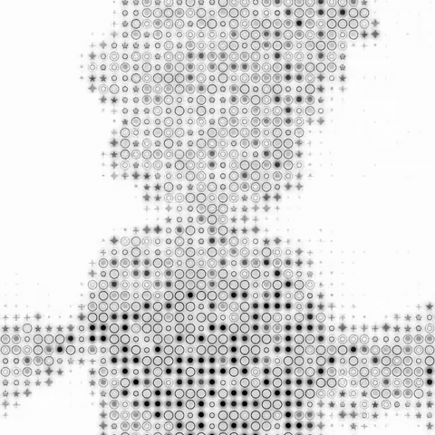

# ASCII Shader

Real-time **ASCII / halftone** post-processing effect applied to video, built with
[three.js](https://threejs.org/) + [`pmndrs/postprocessing`](https://github.com/pmndrs/postprocessing).
Every grid cell has **memory** (it morphs gradually toward its target color and luminance),
plus a bloom-like ink bleed, film grain with blend modes, and an Apple-style frosted-glass UI.

Vanilla JS, **no framework** — dependencies installed via npm and served/bundled by
[Vite](https://vitejs.dev/).

<p align="center">
  
</p>

<p align="center"><sub>Real canvas capture (effect applied to “Bad Apple!!”).</sub></p>

## Features

- **Glyph-atlas ASCII effect** — each cell's luminance picks a glyph from an atlas built at
  runtime (`' ·•+✦★○◯●'`), with per-cell variety for the “mixed symbols” look.
- **Sobel edge detection** (optional) with dedicated directional glyphs (`- | / \`) on contours.
- **Per-cell memory** — each cell morphs *gradually* toward its target color/luminance
  (exponential smoothing, no flicker); change speed is tunable from very slow to near-instant,
  with a **“magnetic” cross-fade** between glyphs.
- **Ink bleed** as a separate bloom-like pass (Vogel-disk sampling) with built-in **blur** and
  adjustable radius.
- **Film grain** (static) with selectable **blend modes** (Add, Multiply, Screen, Overlay,
  Soft Light, Burn, Dodge…), plus size and opacity controls.
- **Layer blending** — the ASCII layer blends over the underlying video using
  `postprocessing`'s native blend functions (Multiply, Screen, Overlay…).
- **Frosted-glass UI** (Apple-style): segmented source picker, play/pause and a toggle to
  show/hide the panel.
- **Full Tweakpane panel** with **persistence** (localStorage), **JSON export/import** and
  reset to defaults.

## Quick start

```bash
npm install      # install dependencies
npm run dev      # start the Vite dev server
# then open the printed URL (default http://localhost:5173)
```

Production build: `npm run build` (outputs to `dist/`); preview it with `npm run preview`.

The video autoplays (muted); pick a source from the bottom selector.

## Controls

A frosted-glass bar at the bottom holds the **source selector** (bad apple · fragole · 5 fiori),
**play/pause** and a **⚙ settings** button (show/hide the panel).

The **Tweakpane** panel (top-right) groups every parameter:

| Folder | Controls |
|---|---|
| **Griglia** (Grid) | cell size |
| **Caratteri** (Characters) | glyph set, variety, glyph size |
| **Grana** (Grain) | grain opacity, size and blend mode |
| **Ink bleed** | intensity, radius, blur, blend ↔ ASCII |
| **Memoria / Trail** (Memory) | on/off, change speed, cross-fade, magnetism |
| **Luminanza** (Luminance) | brightness, contrast, gamma |
| **Colore** (Color) | mode, ASCII ↔ video blend, ink/background, white cutoff |
| **Contorni (Sobel)** (Edges) | edge detection on/off, threshold, glyphs |
| **Video** | source, speed, pause |
| **Preset / Stato** (Preset / State) | JSON export / import, reset to defaults |

> Note: the in-app UI labels are in Italian; the table above maps them to English.

## How it works

The scene is a full-screen quad with a `VideoTexture`; on top runs the pipeline
`EffectComposer → RenderPass → EffectPass(ASCII) → EffectPass(InkBleed)`.

- **Luminance → glyph** (UV-sampled atlas) — technique by
  [Maxime Heckel](https://blog.maximeheckel.com/posts/post-processing-as-a-creative-medium/).
- **Sobel contour glyphs** — inspired by
  [humanbydefinition](https://github.com/humanbydefinition/p5js-edge-detection-ascii-renderer).
- **Per-cell memory**: a ping-pong of grid-resolution render targets (one texel per cell)
  keeps state between frames; each cell converges to its target with exponential inertia. The
  “morph activity” drives the magnetic cross-fade between glyphs.

## Project structure

```
package.json            # npm scripts (dev / build / preview) + dependencies
index.html              # markup, UI styles, app entry
src/
  main.js               # three.js setup, pipeline, Tweakpane, persistence
  AsciiEffect.js        # ASCII effect (glyph atlas + Sobel + grain)
  MemoryGrid.js         # per-cell memory (ping-pong RT, morph)
  InkBleed.js           # bloom-like ink bleed (Vogel spiral + blur)
  overlay.js            # frosted-glass bottom bar (selector + play + settings)
assets/                 # source videos + preview.gif
tools/                  # procedural video generators (numpy + ffmpeg)
```

> Source code comments are in Italian.

## Stack

[three.js](https://threejs.org/) `0.161` · [postprocessing](https://github.com/pmndrs/postprocessing)
`6.36.3` · [Tweakpane](https://tweakpane.github.io/docs/) `4.0.5` — installed via npm and bundled
by [Vite](https://vitejs.dev/).

## Assets

The “flower” videos are **procedurally generated** (`tools/gen_flowers.py`,
`tools/gen_flower.py`) with numpy + ffmpeg.

Credits / licenses of the demo sources included:

- **Bad Apple!!** — the well-known Touhou shadow-art PV; copyright of its respective authors.
- **Big Buck Bunny** — © Blender Foundation, [CC-BY 3.0](https://peach.blender.org/about/).
- **Fragole** (strawberries) — sample clip.
- **5 fiori** (5 flowers) — procedurally generated (see `tools/`).
