# Parameters

Complete reference for every parameter of the toolkit. Each one is a **constructor option**
*and* a live **getter/setter** on the instance — set it at creation or change it at runtime:

```js
const ascii = new AsciiEffect({ cellSize: 16, glyphBlend: true });
ascii.cellSize = 24;        // same parameter, live
ascii.sdfMorph = true;
```

The animated GIFs below sweep each parameter across its useful range (on a fixed video frame,
so you see *only* what that parameter changes). The label in parentheses is the one shown in
the demo's Tweakpane panel (Italian).

> Defaults listed are the **library defaults** (the `AsciiEffect`/`InkBleedEffect`/`MemoryGrid`
> constructor). The demo in `examples/` overrides some of them for its preset.

---

## AsciiEffect

The core effect. Splits the screen into square cells, samples each cell's color/luminance,
picks a glyph and draws it. Subclass of `postprocessing`'s `Effect`.

### `cellSize`
**`number`** · default `16` · range `5…144` (px, drawing buffer) · *(Griglia → cella)*

Size of each grid cell in **device pixels**. Small cells → fine, dense ASCII that follows the
image closely; large cells → big, chunky glyphs and a coarser, more abstract look. Drives how
many glyphs cover the screen, so it's the main "resolution" knob. With per-cell memory active,
`cellSize` also sets the resolution of the `MemoryGrid` (one texel per cell).

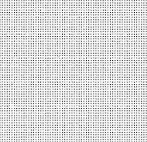

### `glyphScale`
**`number`** · default `1.0` · range `0.3…4.0` · *(Caratteri → dimensione carattere)*

Scale of the glyph **inside** its cell, independent of `cellSize`. `1.0` fills the cell; `<1`
shrinks the glyph leaving empty padding (airy, dotted look); `>1` enlarges it so glyphs touch
or overlap (solid, heavy look). Lets you change glyph weight without changing the grid density.

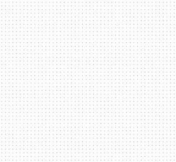

### `charset`
**`string`** · default `' ·•+✦★○◯●'` (`DEFAULT_CHARSET`) · *(Caratteri → set)*

The density ramp: glyphs ordered **light → dark**. The first character (a space) means "empty"
(near-white cells draw nothing). Luminance maps continuously onto this list, so the *shape* and
*order* of the characters define the whole aesthetic. Changing it rebuilds both the alpha atlas
and the SDF atlas. Try `' .:-=+*#%@'` for a classic terminal look. (No sweep GIF — it's text;
see the examples below.)

### `variety`
**`number`** · default `1.0` · range `0…6` · *(Caratteri → varietà glifi)*

Per-cell deterministic jitter of the glyph index. At `0` every cell of equal luminance shows the
**same** glyph (clean, banded). Higher values scatter neighbouring cells across nearby glyphs
(`★`, `○`, `+`, `●`…) at the same luminance, recreating the "mixed symbols" hand-made look. Too
high and the mapping gets noisy/illegible.


### `invert`
**`boolean`** · default `false` · *(—)*

Inverts the luminance → glyph mapping. Normally dark areas get dense glyphs and light areas get
sparse ones; with `invert` it's reversed (a photo-negative of the density).


### `colorMode`
**`0 | 1 | 2 | 3`** · default `2` · *(Colore → modalità)*

How glyphs and background are colored:

- **`0`** — ink/bg: glyphs in `ink` color over `background` color (classic terminal).
- **`1`** — preserve background: dark glyphs "stamped" over the cell's own color.
- **`2`** — video on white *(default)*: glyphs in the video's color over white; near-white cells vanish.
- **`3`** — video on background: glyphs in the video's color over a configurable `background`.

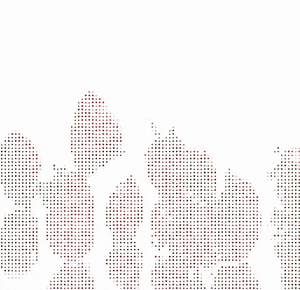

### `ink`
**`[r,g,b]`** (0…1) · default `[0.45, 1.0, 0.45]` · *(Colore → inchiostro)*

Glyph color used **only in `colorMode: 0`**. The default is a phosphor green (CRT look). Exposed
at runtime as a `Vector3` via `ascii.ink` (mutate `.set(r,g,b)`).

### `background`
**`[r,g,b]`** (0…1) · default `[0, 0, 0]` · *(Colore → sfondo)*

Background color used in **`colorMode: 0` and `3`**. Runtime `Vector3` via `ascii.background`.

### `whiteCutoff`
**`number`** · default `0.8` · range `0…1` · *(Colore → soglia bianco)*

Luminance threshold (on the raw linear luma) above which a cell draws **no glyph** at all — it
stays pure background. Lower it to make more of the bright areas drop out (sparser, higher
contrast); raise it to keep glyphs even in highlights. Note: it's a hard cutoff, so during a
morph a cell crossing the threshold pops in/out.


### `brightness`
**`number`** · default `0.0` · range `-0.5…0.5` · *(Luminanza → brightness)*

Luminance offset applied before glyph selection. Negative darkens (denser glyphs), positive
brightens (sparser glyphs). Shifts the whole density ramp.

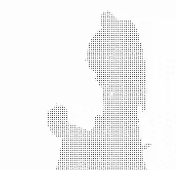

### `contrast`
**`number`** · default `1.0` · range `0…3` · *(Luminanza → contrast)*

Contrast around mid-luminance. `<1` flattens (glyphs converge to mid-density everywhere); `>1`
pushes lights and darks apart (sharper separation between empty and dense glyphs).

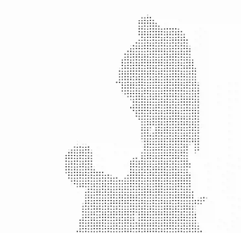

### `gamma`
**`number`** · default `1.0` · range `0.2…3` · *(Luminanza → gamma)*

Gamma correction of the luminance before mapping. Low gamma lifts shadows (more glyphs in dark
areas); high gamma crushes them. A perceptual tilt of the density distribution.


### `edges`
**`boolean`** · default `true` · *(Contorni → attivi)*

Enables **Sobel edge detection**: where the luminance gradient is strong, the cell draws a
directional contour glyph (`-`, `|`, `/`, `\`) instead of a density glyph, tracing outlines.
Off → pure density/halftone look.


### `edgeThreshold`
**`number`** · default `0.3` · range `0…2` · *(Contorni → soglia)*

Sobel gradient magnitude above which a cell is treated as an edge. Low → almost everything
becomes a contour (busy line-art); high → only the strongest outlines. Only relevant when
`edges` is on.


### `edgeChars`
**`string`** · default `'-|/\\'` (`DEFAULT_EDGE_CHARS`) · *(Contorni → glifi)*

The four directional glyphs used for contours, in fixed order: horizontal, vertical, `/`, `\`.
Chosen per cell from the gradient angle. (Text parameter — no sweep GIF.)

### `glyphBlend`
**`boolean`** · default `false` · *(Memoria/Trail → cross-fade glifo)*

When on, transitions between two adjacent density glyphs are a **cross-fade** instead of a hard
snap — driven by the per-cell morph activity. This is the prerequisite for smooth glyph
transitions, `magnet` and `sdfMorph`. Off → glyphs snap to the nearest one (crisp, "digital").

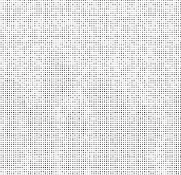

### `magnet`
**`number`** · default `0.6` · range `0…1.5` · *(Memoria/Trail → magnetismo)*

"Magnetism" of the cross-fade. At `0` the blend is a pure, prolonged cross-fade (cells spend
time in the ambiguous mid-state between two glyphs). Higher values **snap** a settled cell to a
single crisp glyph and only blend while it's actively changing — cleaner, more legible, less
"mushy". Only relevant with `glyphBlend` (and per-cell memory) on.

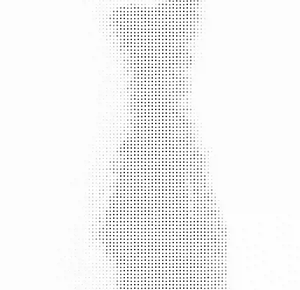

### `sdfMorph`
**`boolean`** · default `false` · *(Morph di forma → attivo)*

The headline feature. Instead of cross-fading the alpha of two glyphs (double-exposure), it
interpolates their **signed distance fields** and thresholds the result: the current glyph's
**shape transforms** into the target's, passing through connected in-between forms (a
"face-morph" between characters). The charset characters act as keyframes. Requires `glyphBlend`
(and ideally per-cell memory) for there to be a transition to morph.

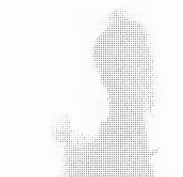

### `sdfThreshold`
**`number`** · default `0.5` · range `0.2…0.8` · *(Morph di forma → spessore tratti)*

Threshold of the SDF (`0.5` = the glyph's true edge). Below `0.5` **fattens** the strokes
(bolder glyphs, thin marks survive better); above `0.5` **thins** them (lighter, eventually
eroding small glyphs away). Use it to compensate thin symbols like `·` and `+`. Only with
`sdfMorph` on.


### `sdfAA`
**`number`** · default `0.04` · range `0…0.3` · *(Morph di forma → morbidezza bordo)*

Width of the smoothstep around the SDF threshold = antialiasing/softness of the glyph edge.
Near `0` gives razor-sharp edges; higher values give a soft, glowing/blurred outline. Only with
`sdfMorph` on.


### `colorVar`
**`number`** · default `0.10` · range `0…1` · *(—)*

Per-character **mottling**: soft, screen-space noise that makes spots within each glyph slightly
lighter/darker, for a more organic, inked texture. `0` = flat, uniform glyph color.

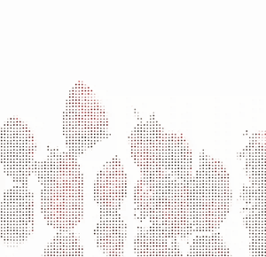

### `noise`
**`number`** · default `0.06` · range `0…1` · *(Grana → grana opacità)*

Opacity of a static **film-grain** layer composited over everything. `0` = none; higher = more
grain. The blend used is set by `noiseMode`.

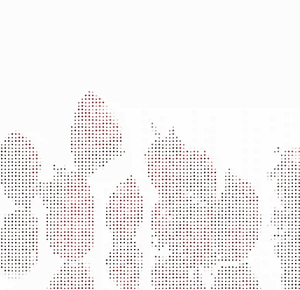

### `noiseScale`
**`number`** · default `1.0` · range `1…24` (px) · *(Grana → dimensione)*

Size of the grain in pixels. `1` = fine, per-pixel speckle; higher values quantize it into
bigger blocks (coarse, chunky grain). Only visible when `noise > 0`.

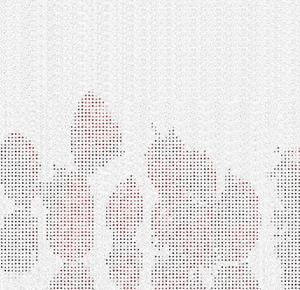

### `noiseMode`
**`0…7`** · default `0` · *(Grana → fusione ↔ output)*

How the grain blends with the output (Photoshop-style):
`0` Additive · `1` Multiply · `2` Screen · `3` Overlay · `4` Soft Light · `5` Linear Burn ·
`6` Color Burn · `7` Color Dodge. Changes whether grain darkens, lightens or adds contrast.

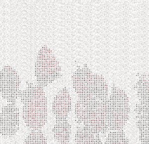

### `useMemory`
**`boolean`** · default `false` · *(Memoria/Trail → memoria)*

Use the per-cell `MemoryGrid` state instead of the live video sample. With memory on, each cell
**morphs gradually** toward its target color/luminance (trail/inertia) and exposes the "morph
activity" that drives `glyphBlend`/`sdfMorph`. Off → instant, live sampling (no trail). Requires
wiring a `MemoryGrid` (see below).

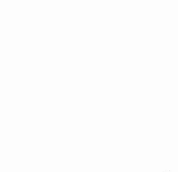

---

## InkBleedEffect

A separate bloom-like pass to run **after** the AsciiEffect (`new EffectPass(camera, inkBleed)`).
Spreads/halos the ink using golden-angle (Vogel-disk) sampling.

### `bleed`
**`number`** · default `0.5` · range `0…2` · *(Ink bleed → intensità)*

Strength of the ink bleed/halo. `0` = off (passthrough); higher values spread the ink further
and brighter, like wet ink on paper or a soft glow around glyphs.

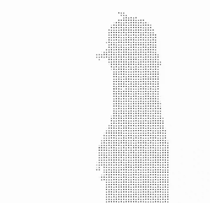

### `radius`
**`number`** · default `24` · range `0…80` (px) · *(Ink bleed → raggio bleed/blur)*

Radius of the bleed/blur sampling in pixels. Small → tight halo hugging the glyphs; large →
wide, diffuse spread. Also sets the radius of the `blur` component.


### `blur`
**`number`** · default `0.0` · range `0…1` · *(Ink bleed → blur)*

Mixes in a plain blur of the image (using the same `radius`) on top of the bleed. `0` = pure
bleed (glyphs stay sharp); `1` = fully blurred. Useful for a dreamy/soft-focus pass.


---

## MemoryGrid

Per-cell temporal memory. **Not** an `Effect` — it's a helper you update each frame before
`composer.render()`. It keeps each cell's "morphed" color between frames in a ping-pong of
grid-resolution render targets, and outputs the texture you assign to `ascii.memoryTexture`.

### `rate`
**`number`** · default `1.2` · range `0.075…60` · *(Memoria/Trail → velocità cambio)*

Speed at which each cell converges to its target (exponential inertia). **Low** = slow,
long-lasting trail (cells lag far behind the video — smeary, painterly); **high** = fast,
near-instant (almost no trail). Also governs how much "morph activity" there is for
`glyphBlend`/`sdfMorph` to act on.

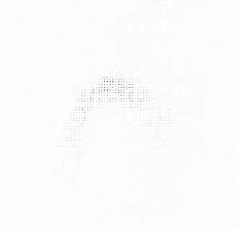

---

## Parameter interactions (cheat-sheet)

- **Smooth glyph transitions** need `useMemory: true` + `glyphBlend: true`. Without memory there's
  no temporal activity, so the cross-fade/morph has nothing to animate.
- **`sdfMorph`** is layered on top of `glyphBlend`: it changes *how* the two glyphs blend (shape
  morph vs alpha cross-fade). `magnet` still controls when a cell snaps to a crisp glyph.
- **`magnet` / `rate`** together shape the "feel": low `rate` + low `magnet` = liquid, lingering
  morphs; high `magnet` = crisp snapping.
- **`ink` / `background`** only matter in the `colorMode`s that use them (0, and 3 for background).
- **Grain** (`noiseScale`, `noiseMode`) only shows when `noise > 0`.
- **`edgeThreshold` / `edgeChars`** only matter when `edges: true`.
